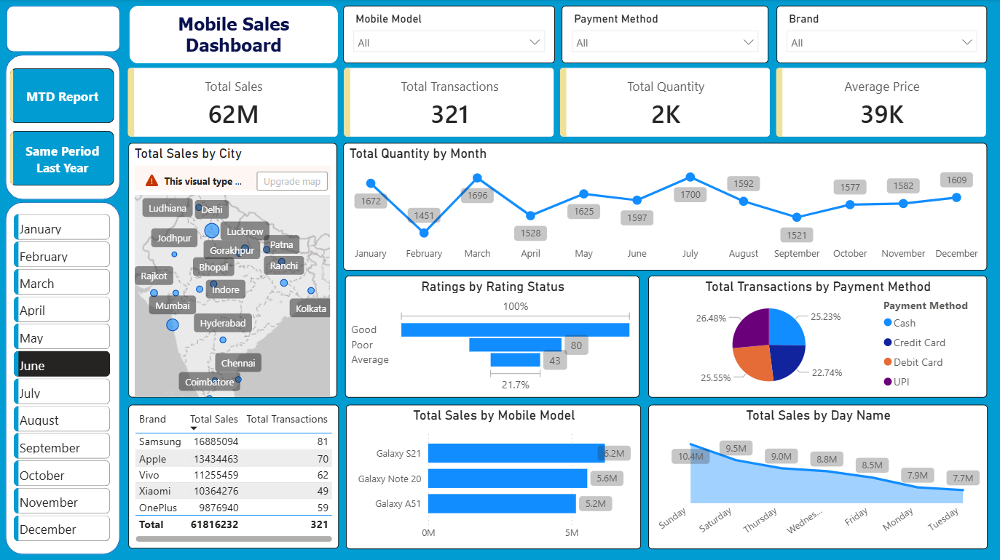
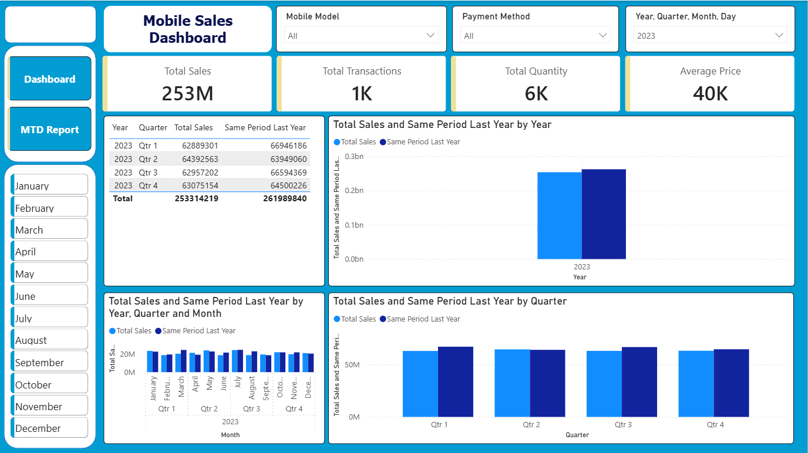

# 📱 Mobile Sales Dashboard | Power BI

An interactive **Power BI dashboard** built to analyze mobile phone sales data across different cities, brands, payment methods, and time periods. The project provides business insights through interactive visualizations, KPI cards, and time intelligence reports such as **Month-to-Date (MTD)** and **Same Period Last Year (SPLY)** analysis.

---

# 📌 Project Overview

The Mobile Sales Dashboard helps business users monitor sales performance, identify trends, compare historical data, and make data-driven decisions.

The report consists of **three interactive pages**:

- 📊 Dashboard
- 📈 MTD (Month-to-Date) Report
- 📉 Same Period Last Year (SPLY) Report

---

# 🎯 Business Problem

Retail businesses generate thousands of sales transactions every year. Without an analytical dashboard, it becomes difficult to answer important business questions such as:

- Which mobile brands generate the highest sales?
- Which cities contribute the most revenue?
- Which payment methods are preferred by customers?
- How are monthly sales performing?
- Is the current period performing better than the previous year?
- What are the monthly and quarterly sales trends?

This dashboard transforms raw sales data into meaningful business insights.

---

# 📊 Dashboard Pages

## 1️⃣ Dashboard

Provides an overall business overview through KPIs and interactive visualizations.

### KPIs

- Total Sales
- Total Transactions
- Total Quantity Sold
- Average Selling Price

### Visualizations

- Total Sales by City (Map)
- Total Quantity by Month
- Ratings by Rating Status
- Transactions by Payment Method
- Total Sales by Mobile Model
- Total Sales by Day Name
- Brand-wise Sales Summary Table

### Filters

- Mobile Model
- Brand
- Payment Method
- Month

---

## 2️⃣ MTD (Month-to-Date) Report
Tracks cumulative sales throughout the selected month.

### KPIs

- Total Sales
- Total Transactions
- Total Quantity
- Average Price

### Features

- Daily Month-to-Date Sales Trend
- Date Filter
- Mobile Model Filter
- Payment Method Filter

This report helps monitor monthly business performance and sales progress.

---

## 3️⃣ Same Period Last Year (SPLY) Report
Compares the current year's sales performance with the same period from the previous year.

### Visualizations

- Year-wise Sales Comparison
- Quarter-wise Sales Comparison
- Monthly Sales Comparison
- Quarterly Summary Table

This report helps evaluate:

- Year-over-Year Growth
- Seasonal Trends
- Performance Improvement
- Business Growth

---

# 📈 Dashboard Features

- Interactive Slicers
- KPI Cards
- Time Intelligence (MTD & SPLY)
- Geographic Analysis
- Brand Performance Analysis
- Payment Method Analysis
- Monthly & Quarterly Trends
- Dynamic Filtering

---

# 🛠 Tools & Technologies

- Power BI Desktop
- Power Query
- DAX (Data Analysis Expressions)
- Microsoft Excel

---

# 📂 Dataset

The dataset used for this project is publicly available.

### Dataset includes

- Mobile Brand
- Mobile Model
- Sales Amount
- Quantity
- Transactions
- Customer Rating
- Payment Method
- City
- Date

---

# 📊 DAX Measures Used

- Total Sales
- Total Quantity
- Total Transactions
- Average Price
- MTD Sales
- Same Period Last Year Sales
- Sales Growth Comparison
---

# 💡 Business Insights

Using this dashboard, business users can:

- Monitor overall sales performance.
- Identify top-performing brands and mobile models.
- Analyze sales across different cities.
- Track Month-to-Date sales progress.
- Compare current performance with the previous year.
- Understand customer payment preferences.
- Identify monthly and quarterly sales trends.
---

# 📌 Key Learnings

During this project, I gained practical experience in:

- Designing business-oriented dashboards.
- Creating interactive reports with slicers and filters.
- Implementing DAX measures for business KPIs.
- Building Month-to-Date (MTD) and Same Period Last Year (SPLY) calculations.
- Presenting data in a way that supports business decision-making.

---

# ⭐ Project Outcome

This project demonstrates how Power BI can transform raw mobile sales data into an interactive business intelligence solution. The dashboard enables users to monitor KPIs, analyze sales trends, compare historical performance, and make informed decisions through intuitive visualizations.
